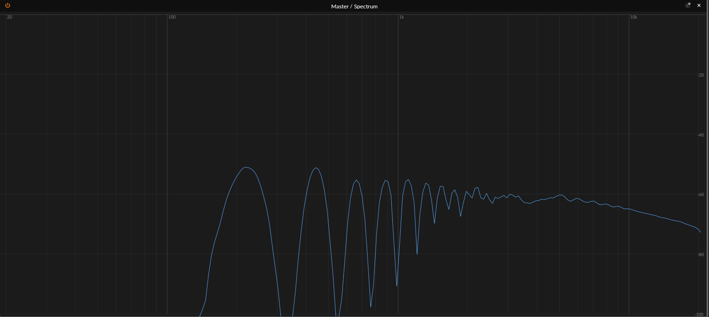

:music:digitone:elektron:

Started 2020/Dec/17 ~11PM

# Algorithms
There are eight algorithms in the Digitone. How do they differ from each other timbrely?
That is what I'd like to explore here.

With eight distinct algorithms how do you begin to test their differences?
Let's examine what the variables are in this system:
- Ratios of operators A, B1, B2, and C
- Harmonics
- Detuning
- Feedback
- Mix

Mathematically speaking, there are a lot of possibilities. Each operator has a range from 0.25 to 16, although not necessarily always in increments of 0.25. Additionally, each algorithm has a different operator that the feedback control impacts. The harmonics parameter has a non-discrete range between -26 and 26. Detuning and feedback have a range from 0-127. Finally the mix parameter I believe operates a range from -64 to 63 where the extremes represent one pathway or the other and 0 being the perfect mix of the two. On top of this are the envelopes and levels of the operators.

Note, these tests are subjective based on my perception.

Also, just thinking about numbers and levels, etc., isn't it funny how abstract numbers are?

I think one simple thing to get out of the way is how feedback impacts the sound.

## Analyzing Saw Patch
Compared the saw patch from the Digitone to Bitwig's Polysynth Sawtooth patch
The patch is very simple: Algo 8, Y track only, feedback at around 40. This produces a sound similar to a sawtooth wave with slight high-end filtering. Below is a screenshot of a spectrum analysis of the output wave.

Let's compare that to an analysis of a saw wave from Bitwig's Polysynth

The two images look very similar with the small exception of the Polysynth having a bit more energy in the higher frequencies. We can see the Digitone saw wave start to dip around 5kHz.

# Backing up sounds / SysEx
Digitone uses [SysEx](./sysex.md) to save sounds

To back up a sound, install a SysEx app like SysEx librarian
Open up the app
Hit "Record messages"

In Digitone:
> gear button
> sysex dump
> sysex send

In the app, you should see an alert about "received X messages"

# Sending Sounds
To back up a sound, install a SysEx app like SysEx librarian
Open up the app
Drop whatever .sysx files you want

In Digitone:
> gear button
> sysex dump
> sysex receive
> pick project/patter/sound and specifics

In the app, trigger sending the files
The digitone should show a message saying "Received project/pattern/sound"

# Analyzing Patches
I'd like to get a better feel for how the digitone works
For this, I first thought I need to analyze the values for different patches
I'm wondering if there's a better way

I know a *kick* sound involves a rapid decline in pitch
But that works for *toms* too

A goal of mine is to get a feel for the algorithms and look for patterns in the patches

# Notes on the Operators
I predict patches 7 and 8 have a slightly thinner, almost tinnier, sound.
I say this after starting a patch from scratch, setting operator A's level to 127, and scanning through the algorithms
All other algorithms outside of 7 and 8 have three operators acting together.
The last two algorithms have operators A and C separate from the Bs.

This leads me to think that analysing the sysex dumps to basically create a database of the patches would be helpful in gaining an understanding on how people use the algorithms
